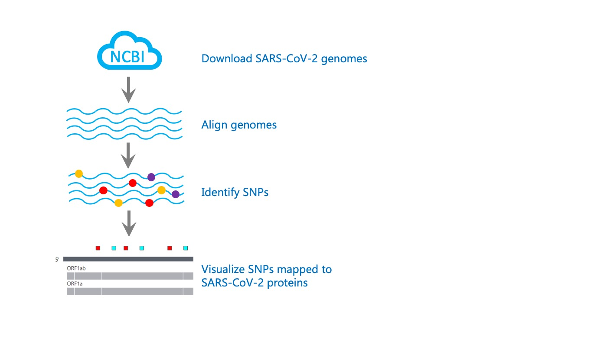
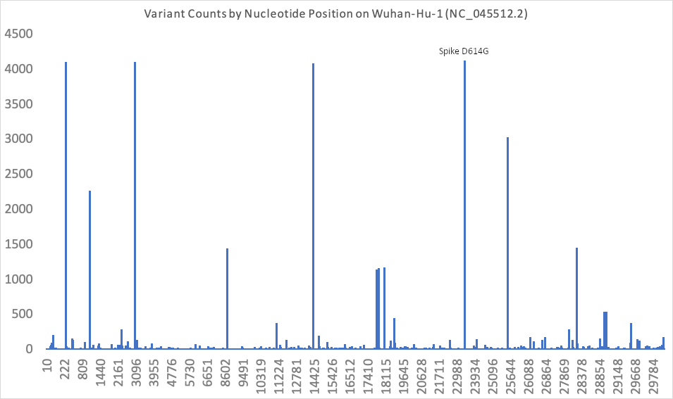
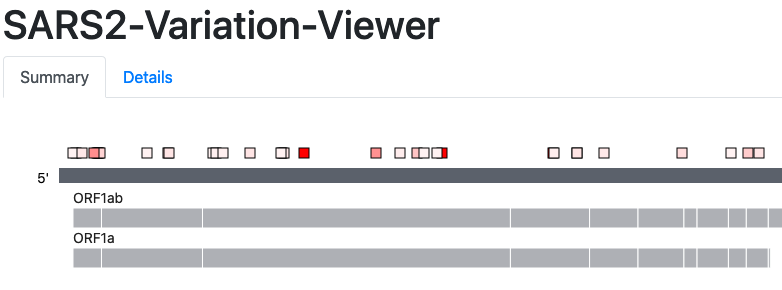
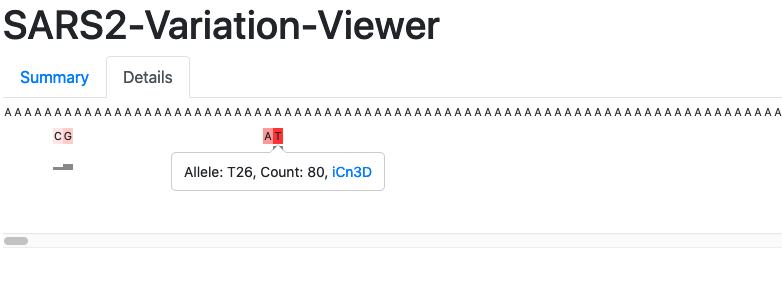

# Variation Analysis and Visualization of SARS-CoV-2 sequences in GenBank
NCBI Datasets Codeathon Team 4

The goal of this project is to identify and visualize variation (SNPs) in SARS-CoV-2 genomes

## Background
Understanding variation across SARS-CoV-2 genome sequences has important implications for epidemiology and molecular biology.

Existing tools allow researchers to visualize SARS-CoV-2 variation but access to the underlying data, including genome sequences and valuable metadata, such as where in the world a particular genome was isolated, is restricted.

The SARS-CoV-2 Variation Viewer allows researchers to easily visualize SARS-CoV-2 SNPs mapped to the annotated Wuhan-Hu-1 reference genome (NC_045512.2), with a searchable tabular view showing amino acid changes, collection location, host species, and links to protein structure views in iCn3D.  

## Workflow
1. Download all SARS-CoV-2 genomes from GenBank using [NCBI Datasets](https://www.ncbi.nlm.nih.gov/datasets/)
2. Identify SNPs in these SARS-CoV-2 genomes
3. Correlate SNPs with SARS-CoV-2 genome metadata (also from **NCBI Datasets**)
4. Visualize SNPs and associated metadata in a graphical display



## Executing the workflow
The workflow depends on 
* bwa
* samtools 
* bcftools

If those are not in `$PATH`, first execute:

```
bash bin/install_tool.sh
```

Next, run the workflow:

```
bash bin/workflow.sh
```

## Download SARS-CoV-2 genomes using NCBI Datasets
* Use the [NCBI Datasets command-line tool](https://www.ncbi.nlm.nih.gov/datasets/docs/command-line-virus/) to download all available SARS-CoV-2 genome sequences (6k+ as of July 8 2020) and associated metadata from GenBank.

## Identify SNPs in SARS-CoV-2 genomes
* Align 6k+ genomes using bwa mem
* Call variants (identify SNPs) using bcftools, which found a total of 48,398 variants
* Encode variants using SPDI format [(Holmes et al., 2019)](https://www.ncbi.nlm.nih.gov/pubmed/31738401)
* Group variants by location and allele, resulting in 4,299 variants.  We threw out any variants
  not seen in at least 5 genomes.  Those variants are plotted here:



* The final filtered set is comprised of 590 viral variations.

## Add metadata and annotation
* The remaining 590 variants were joined to their metadata (e.g. geographic location, collection  date, host) extracted from the NCBI Datasets virus genome data report
* Each variant allele was annotated with the associated protein change, using the CDS FASTA sequence data available in the NCBI Datasets data-package (only 557 variants were in a single 
coding region and annotated).
  * 290 of the variants resulted in a non-synonymous protein change
  * 267 of the variants resulted in a synonymous protein change

### Example variant data

```
    {
      "start": 9560,
      "stop": 9561,
      "reference_sequence": "C",
      "alleles": [
        {
          "allele": "T",
          "count": 6,
          "spdi": "NC_045512.2:9560:C:T",
          "Host": [
            {
              "value": "Homo sapiens",
              "count": 6
            }
          ],
          "Collection Date": [
            {
              "value": "2020-01-11",
              "count": 1
            },
            ...
          ],
          "Collection Location": [
            {
              "value": "USA: CA/North America",
              "count": 5
            },
            {
              "value": "China/Asia",
              "count": 1
            }
          ],
          "codon": "TTA",
          "amino_acid": "L",
          "protein_variant": "S336L",
          "aa_type": "non_synonymous"
        }
      ],
      "protein_name": "nsp4",
      "protein_accession": "YP_009724389.1",
      "protein_position": 336,
      "offset": 1,
      "codon": "TCA",
      "amino_acid": "S"
    },
```

## Visualize SNPs in a graphical display
* Visualize SNPs and associated metadata in a graphical display using two views, summary view and detailed view
* Summary View: Visualize SNPs mapped to the SARS-CoV-2 reference genome with protein annotations
  * Also includes a searchable, sortable tabular view of the data.
* Detailed View: Visualize SNPs mapped to SARS-CoV-2 proteins at single amino acid resolution, with links to [iCn3D](https://www.ncbi.nlm.nih.gov/Structure/icn3d/docs/icn3d_about.html) protein structure views.




## SARS2 Variation Viewer Live Demo
[https://ncbi-codeathons.github.io/SARS2-Variation-Viewer/](https://ncbi-codeathons.github.io/SARS2-Variation-Viewer/)

