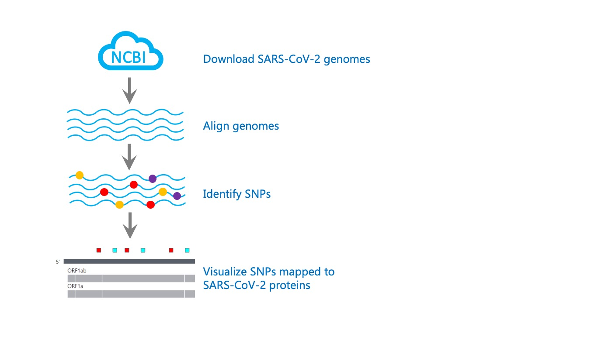

# Variation Analysis and Visualization of SARS-CoV-2 sequences in GenBank
NCBI Datasets Codeathon Team 4

The goal of this project is to identify and visualize variation (SNPs) in SARS-CoV-2 genomes

1. Download all SARS-CoV-2 genomes from GenBank using [NCBI Datasets](https://www.ncbi.nlm.nih.gov/datasets/)
2. Identify SNPs in these SARS-CoV-2 genomes
3. Correlate SNPs with SARS-CoV-2 genome metadata
4. Visualize SNPs and associated metadata in a graphical display

## Download SARS-CoV-2 genomes using NCBI Datasets
* Use the [NCBI Datasets command-line tool](https://www.ncbi.nlm.nih.gov/datasets/docs/command-line-virus/) to download all available SARS-CoV-2 genome sequences (6k+ as of July 8 2020) and associated metadata from GenBank 

## Identify SNPs in these SARS-CoV-2 genomes
* Align 6k+ genomes using bwa mem
* Call variants (identify SNPs) using bcftools
* Encode variants using SPDI format [(Holmes et al., 2019)](https://www.ncbi.nlm.nih.gov/pubmed/31738401)

## Correlate SNPs with SARS-CoV-2 genome metadata
* Extract metadata, e.g. geographic location, host isolate, etc. from the NCBI Datasets virus genome data report
* Join variant data to virus metadata

## Visualize SNPs in a graphical display
* Visualize SNPs and associated metadata in a graphical display using two views, detailed view and assembly view
* Detailed View: Visualize SNPs mapped to SARS-CoV-2 proteins at single amino acid resolution, with links to [iCn3D](https://www.ncbi.nlm.nih.gov/Structure/icn3d/docs/icn3d_about.html) protein structure views 
* Assembly View: Visualize SNPs mapped to the SARS-CoV-2 reference genome with protein annotations
